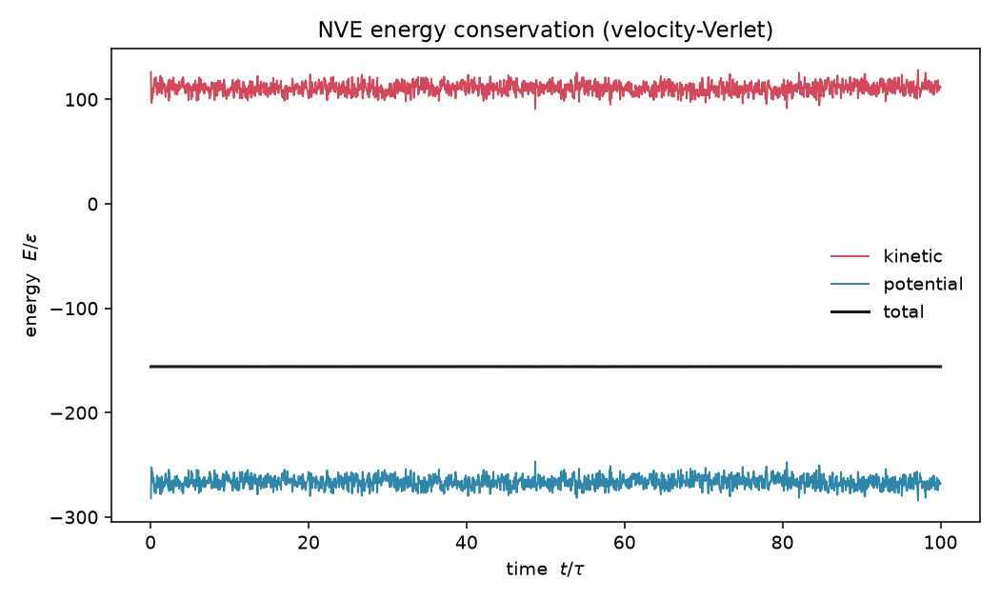
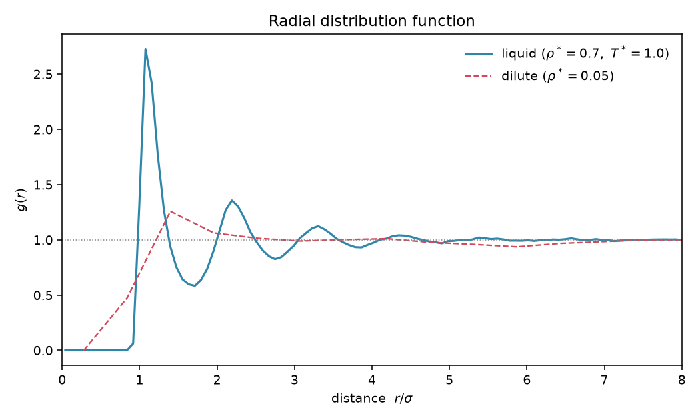
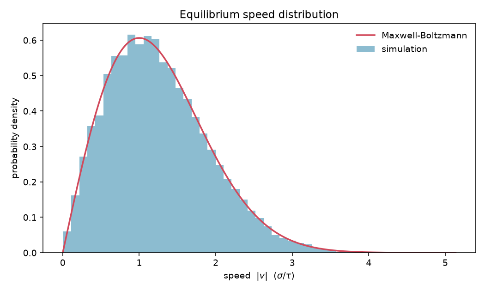

# molecular-dynamics

A Lennard-Jones molecular-dynamics simulation of a 2-D (default) or 3-D gas or
liquid, written in pure [NumPy](https://numpy.org/). It integrates Newton's
equations for particles interacting through the truncated-and-shifted
Lennard-Jones 12-6 potential, with periodic boundaries and an `O(N)` cell list,
and validates the results against closed-form statistical mechanics: energy and
momentum conservation, the radial distribution function `g(r)`, the
Maxwell-Boltzmann speed distribution, and the virial pressure.

It is a compact, physics-first teaching and research scaffold — not a
high-performance production code. There is no GPU, MPI, or fancy neighbour-list
rebuild heuristic, and it models a single-component monatomic fluid only. What
it does do, it checks quantitatively.



## Why this project

Molecular dynamics is deceptively easy to get *approximately* right and
surprisingly easy to get *subtly* wrong: a missing energy shift, a sign error in
the minimum-image convention, or a non-symplectic integrator all produce
trajectories that look plausible but drift, break detailed balance, or violate
equipartition. This project treats those failure modes as testable claims. Every
piece of physics — the force is the negative gradient of the potential, the cell
list reproduces the brute-force forces to machine precision, the total energy
neither drifts nor fluctuates, the equilibrium speeds are Rayleigh/Maxwell
distributed — is asserted with a concrete numerical tolerance against an analytic
reference or the brute-force implementation.

## Highlights

- **Truncated-and-shifted Lennard-Jones 12-6** potential and pair force, with a
  `2.5σ` cutoff and an energy shift that makes the potential continuous (zero) at
  the cutoff.
- **Velocity-Verlet integration** (symplectic, time-reversible, second-order):
  bounded energy fluctuations, no secular drift, and momentum conserved to
  floating-point precision.
- **Periodic boundaries with the minimum-image convention** in 2-D and 3-D.
- **Fully vectorized `O(N)` linked-cell list** whose forces, energy and virial
  match the brute-force `O(N²)` loop to machine precision — the only Python-level
  loop is over the constant neighbour stencil, never over cells or pairs.
- **Observables**: kinetic/potential energy, instantaneous temperature from
  equipartition, radial distribution function `g(r)`, speed histogram, and the
  virial pressure.
- **NVT thermostats**: Berendsen weak coupling and Andersen stochastic
  collisions.
- **Closed-form references** in `mdlj/analytic.py` for the Maxwell-Boltzmann
  distributions, equipartition energy and ideal-gas law, used both by the tests
  and the example figures.
- **Reduced Lennard-Jones units** throughout (`ε = σ = m = k_B = 1`).

## Reduced units

All quantities use reduced Lennard-Jones units with `ε = σ = m = k_B = 1`:

| quantity     | unit                                   |
|--------------|----------------------------------------|
| length       | `σ`                                    |
| energy       | `ε`                                    |
| temperature  | `ε / k_B`                              |
| time         | `τ = σ √(m / ε)`                       |
| density      | `σ^(-d)` (`d` = dimension)             |

## Results

Numbers below are produced directly by the example scripts (seed `2026`).

**Energy & momentum conservation** — NVE, 2-D, `N = 144`, `ρ* = 0.7`,
`dt = 0.005 τ`, 20 000 steps (`python examples/nve_energy_demo.py`):

| quantity                                | measured   |
|-----------------------------------------|------------|
| relative energy fluctuation `std(E)/⟨E⟩`| `1.0 × 10⁻⁴`|
| relative energy drift `|E_f − E_i|/|E_i|`| `2.9 × 10⁻⁵`|
| max `|P(t) − P(0)|` (linear momentum)   | `9 × 10⁻¹⁴`|

**Radial distribution function** — 2-D liquid, `ρ* = 0.7`, `T* = 1.0`
(`python examples/gofr_demo.py`):

| quantity                          | measured        |
|-----------------------------------|-----------------|
| first-peak location               | `r = 1.08 σ`    |
| first-peak height                 | `g = 2.73`      |
| tail average of `g(r)`            | `1.00` (→ 1)    |
| neighbours in first shell (`r<1.6σ`)| `5.4`         |
| dilute (`ρ* = 0.05`) tail average | `0.99` (flat)   |



**Maxwell-Boltzmann speeds** — 2-D, `T* = 1.0`
(`python examples/maxwell_boltzmann_demo.py`):

| quantity           | measured | analytic |
|--------------------|----------|----------|
| mean speed `⟨v⟩`   | `1.2525` | `1.2533` |
| rms speed `v_rms`  | `1.4135` | `1.4142` |
| KS statistic vs analytic CDF | `0.003` (`p = 0.96`) | — |



**Temperature control** — the Berendsen thermostat holds the time-averaged
temperature to within `0.4%` of the set point, and equipartition gives equal
kinetic energy per component (per-component velocity variance within `~1%` of
`k_B T`). At low density the virial pressure reduces to the ideal-gas law
`P = ρ k_B T` to within `~1%`.

## Quickstart

```bash
# install
pip install -r requirements.txt          # numpy, scipy, matplotlib, pillow, pytest

# run the physics test suite (~30 s, deterministic)
python -m pytest -q

# generate the figures above
python examples/nve_energy_demo.py        # -> figures/energy_conservation.png
python examples/gofr_demo.py              # -> figures/gofr.png
python examples/maxwell_boltzmann_demo.py # -> figures/maxwell_boltzmann.png
python examples/animation_demo.py         # -> figures/animation.gif
```

A minimal simulation from the library:

```python
import numpy as np
from mdlj import (System, Simulation, initialize_positions,
                  maxwell_boltzmann_velocities)

rng = np.random.default_rng(0)
pos, box = initialize_positions(256, density=0.7, dim=2, lattice="square")
vel = maxwell_boltzmann_velocities(len(pos), 2, temperature=1.0, rng=rng)

sim = Simulation(System(pos, vel, box), dt=0.005)   # NVE (microcanonical)
history = sim.run(5000, sample_every=10)

print(history["total_energy"].std() / abs(history["total_energy"].mean()))
```

## How it works

**Lennard-Jones potential.** Particles interact through

```
U(r) = 4ε [ (σ/r)¹² − (σ/r)⁶ ]
```

which has a minimum at `r_min = 2^(1/6) σ ≈ 1.1225 σ` where `U = −ε` and the
force vanishes. The pair force is the negative gradient,
`F(r) = (24ε/r) [ 2(σ/r)¹² − (σ/r)⁶ ]`, applied as the vector
`F_ij = 24ε [2(σ/r)¹² − (σ/r)⁶] r_ij / r²`. The potential is truncated at
`r_c = 2.5 σ` and shifted by `U(r_c)` so the energy is continuous (zero) at the
cutoff; the unshifted well there is only `≈ −0.0163 ε`.

**Velocity-Verlet.** Each step advances

```
x(t + dt) = x(t) + v(t) dt + ½ a(t) dt²
a(t + dt) = F(x(t + dt)) / m
v(t + dt) = v(t) + ½ [a(t) + a(t + dt)] dt
```

The scheme is second-order accurate and symplectic, so the total energy stays
bounded (no long-time drift) and, because the force update is symmetric across a
pair, the total linear momentum is conserved exactly.

**Periodic boundaries / minimum image.** Particles live in a square (2-D) or
cubic (3-D) box of side `L` with periodic boundaries. Pair separations use the
minimum image convention: each displacement component is mapped into
`[−L/2, L/2]` by `dx → dx − L · round(dx / L)`, so a particle interacts with the
nearest periodic image of each partner.

**Cell list.** Because the interaction is truncated at `r_c`, only nearby
particles matter. Particles are binned into a grid of cells of side `≥ r_c`;
each particle then interacts only with partners in its own and neighbouring
cells, giving `O(N)` force evaluation. Candidate pairs feed the *same* vectorized
force routine as the brute-force path, so the two agree to machine precision —
this equivalence is a test, not an aspiration.

## Project layout

```
molecular-dynamics/
├── mdlj/                       # the source package (import name: mdlj)
│   ├── __init__.py             # public API, reduced-units docstring, __version__
│   ├── potential.py            # LJ 12-6 potential and pair force, cutoff + shift
│   ├── simulation.py           # System (state, PBC, forces) + Simulation loop
│   ├── integrator.py           # velocity-Verlet step
│   ├── neighbors.py            # vectorized O(N) linked-cell list
│   ├── observables.py          # KE, temperature, g(r), speeds, virial pressure
│   ├── thermostat.py           # Berendsen and Andersen thermostats (NVT)
│   ├── initialize.py           # lattice positions + Maxwell-Boltzmann velocities
│   ├── analytic.py             # closed-form references (MB, equipartition, ideal gas)
│   └── plotting.py             # headless-safe (Agg) figure helpers
├── examples/                   # runnable demos that save figures/ and print numbers
│   ├── nve_energy_demo.py
│   ├── gofr_demo.py
│   ├── maxwell_boltzmann_demo.py
│   └── animation_demo.py
├── tests/                      # physics-validating pytest suite
├── figures/                    # figures written by the example scripts
├── README.md
├── requirements.txt
├── pyproject.toml
├── LICENSE
└── .github/workflows/ci.yml    # pytest on Python 3.10 / 3.11 / 3.12
```

## References

- M. P. Allen and D. J. Tildesley, *Computer Simulation of Liquids*, 2nd ed.
  (Oxford University Press, 2017).
- D. Frenkel and B. Smit, *Understanding Molecular Simulation: From Algorithms to
  Applications*, 2nd ed. (Academic Press, 2002).
- L. Verlet, "Computer 'Experiments' on Classical Fluids. I. Thermodynamical
  Properties of Lennard-Jones Molecules," *Phys. Rev.* **159**, 98 (1967).
- H. J. C. Berendsen et al., "Molecular dynamics with coupling to an external
  bath," *J. Chem. Phys.* **81**, 3684 (1984).

## License

Released under the [MIT License](LICENSE). Copyright (c) 2026 Wei Chen.
